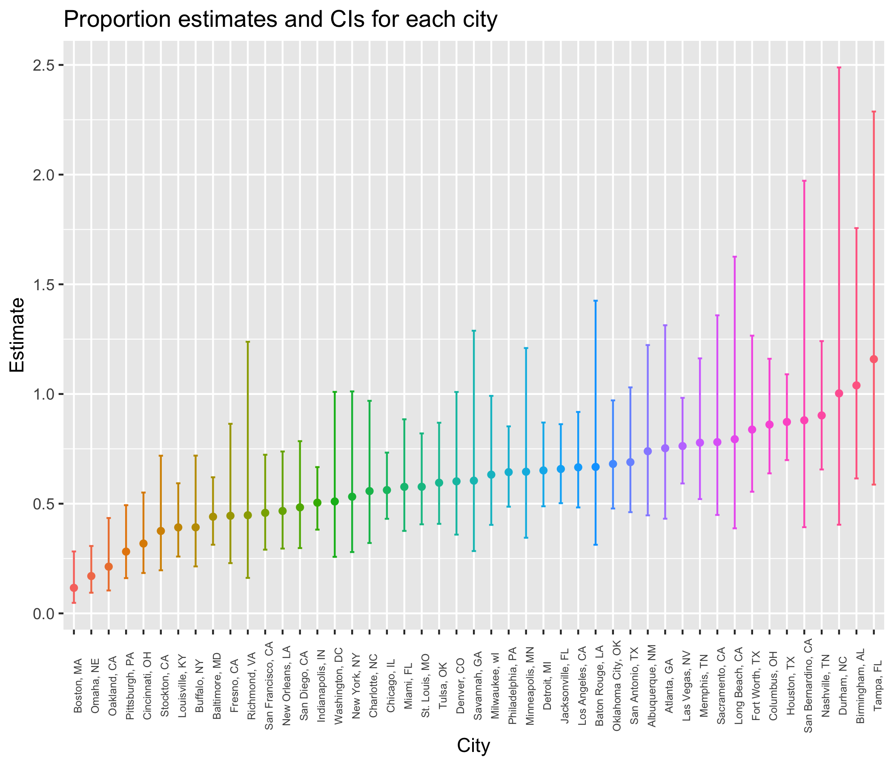
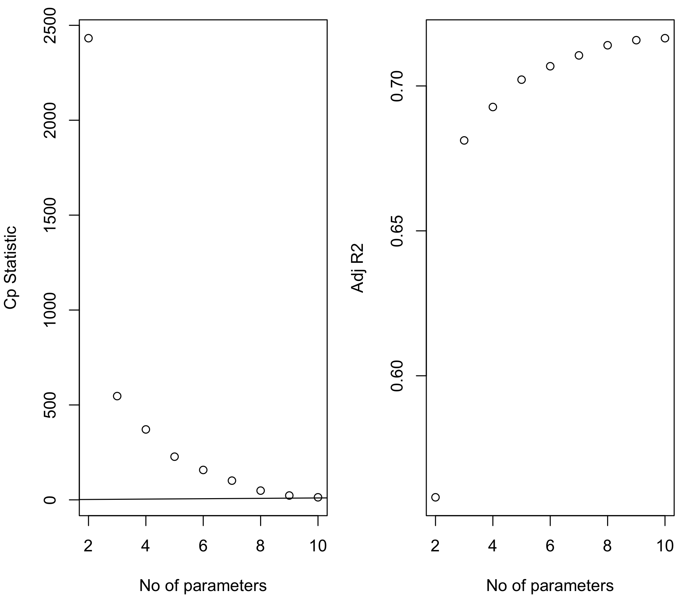
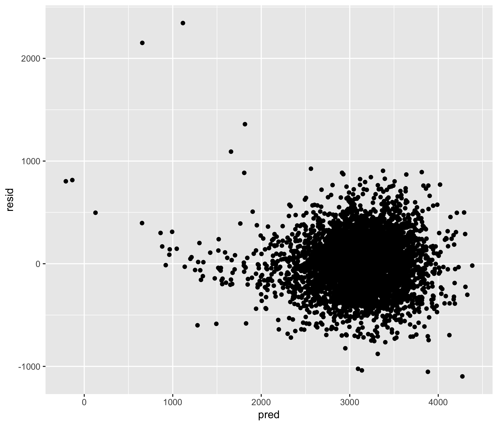
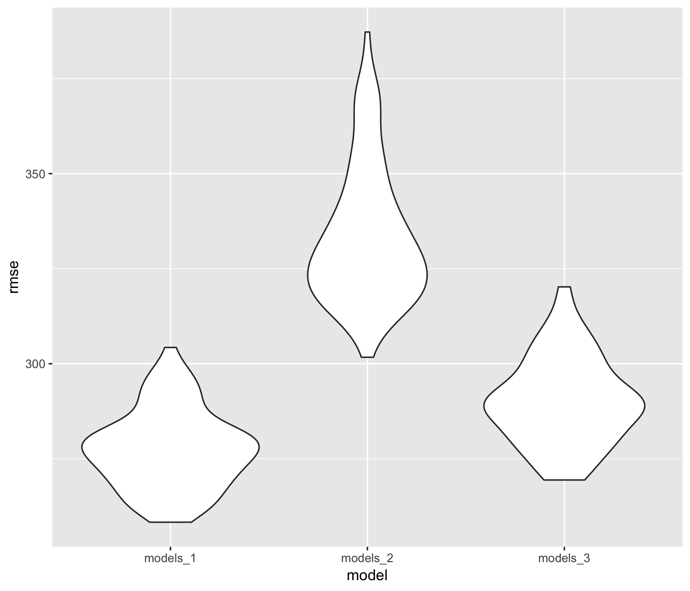

p8105\_hw6\_mm5354
================
Mengran Ma
2018/11/15

Problem 1
=========

### Create a city\_state variable (e.g. “Baltimore, MD”), and a binary variable indicating whether the homicide is solved. Omit cities Dallas, TX; Phoenix, AZ; and Kansas City, MO – these don’t report victim race. Also omit Tulsa, AL – this is a data entry mistake. Modifiy victim\_race to have categories white and non-white, with white as the reference category. Be sure that victim\_age is numeric.

``` r
tidy_data = 
  read_csv("/Users/nadongma/Desktop/p8105_hw6_mm5354/homicide_data.csv") %>% 
  janitor::clean_names() %>%
  unite(city_state, city, state, sep = ", ", remove = FALSE) %>%
  mutate(solved_or_not = 1) %>%
  mutate(solved_or_not = 0 * (disposition != "Closed by arrest") + 1 * (disposition == "Closed by arrest")) %>%
  filter(city_state != "Dallas, TX" & city_state != "Phoenix, AZ" & city_state != "Kansas City, MO" & city_state != "Tulsa, AL") %>%
  filter(victim_race != "Unknown") %>% 
  mutate(victim_race = 1 * (victim_race != "White") + 0 * (victim_race == "White")) %>% 
  mutate(victim_age = as.numeric(victim_age))
```

    ## Parsed with column specification:
    ## cols(
    ##   uid = col_character(),
    ##   reported_date = col_integer(),
    ##   victim_last = col_character(),
    ##   victim_first = col_character(),
    ##   victim_race = col_character(),
    ##   victim_age = col_character(),
    ##   victim_sex = col_character(),
    ##   city = col_character(),
    ##   state = col_character(),
    ##   lat = col_double(),
    ##   lon = col_double(),
    ##   disposition = col_character()
    ## )

    ## Warning in evalq(as.numeric(victim_age), <environment>): 强制改变过程中产生
    ## 了NA

### For the city of Baltimore, MD, use the glm function to fit a logistic regression with resolved vs unresolved as the outcome and victim age, sex and race (as just defined) as predictors. Save the output of glm as an R object; apply the broom::tidy to this object; and obtain the estimate and confidence interval of the adjusted odds ratio for solving homicides comparing non-white victims to white victims keeping all other variables fixed.

``` r
logistic_regression = tidy_data %>% 
  filter(city_state == "Baltimore, MD") %>% 
  glm(solved_or_not ~ victim_age + victim_sex + victim_race, data = ., family = binomial()) %>%
  broom::tidy() %>%
  mutate(OR = exp(estimate),
         lower_bound = exp(estimate - std.error*1.96),
         upper_bound = exp(estimate + std.error*1.96)) %>%
  select(term, log_OR = estimate, lower_bound, upper_bound, OR, p.value) %>% 
  knitr::kable(digits = 3)
logistic_regression
```

| term            |  log\_OR|  lower\_bound|  upper\_bound|     OR|  p.value|
|:----------------|--------:|-------------:|-------------:|------:|--------:|
| (Intercept)     |    1.186|         2.067|         5.186|  3.274|    0.000|
| victim\_age     |   -0.007|         0.987|         0.999|  0.993|    0.032|
| victim\_sexMale |   -0.888|         0.315|         0.537|  0.412|    0.000|
| victim\_race    |   -0.820|         0.313|         0.620|  0.441|    0.000|

### Now run glm for each of the cities in your dataset, and extract the adjusted odds ratio (and CI) for solving homicides comparing non-white victims to white victims. Do this within a “tidy” pipeline, making use of purrr::map, list columns, and unnest as necessary to create a dataframe with estimated ORs and CIs for each city.

``` r
city_nest = tidy_data %>% 
  group_by(city_state) %>% 
  nest() %>%
  mutate(models = map(data, ~glm(solved_or_not ~ victim_age + victim_race + victim_sex, data = ., family = binomial())),
         models = map(models, broom::tidy)) %>% 
  select(-data) %>% 
  unnest() %>%
  mutate(OR = exp(estimate),
         lower_bound = exp(estimate - std.error*1.96),
         upper_bound = exp(estimate + std.error*1.96)) %>%
  select(city_state, term, log_OR = estimate, OR, lower_bound, upper_bound, p.value)
city_nest %>%
  filter(term == "victim_race") %>% 
  knitr::kable(digits = 3)
```

| city\_state        | term         |  log\_OR|     OR|  lower\_bound|  upper\_bound|  p.value|
|:-------------------|:-------------|--------:|------:|-------------:|-------------:|--------:|
| Albuquerque, NM    | victim\_race |   -0.302|  0.739|         0.447|         1.223|    0.240|
| Atlanta, GA        | victim\_race |   -0.284|  0.753|         0.432|         1.313|    0.317|
| Baltimore, MD      | victim\_race |   -0.820|  0.441|         0.313|         0.620|    0.000|
| Baton Rouge, LA    | victim\_race |   -0.404|  0.668|         0.313|         1.425|    0.296|
| Birmingham, AL     | victim\_race |    0.039|  1.039|         0.615|         1.756|    0.886|
| Boston, MA         | victim\_race |   -2.151|  0.116|         0.048|         0.282|    0.000|
| Buffalo, NY        | victim\_race |   -0.936|  0.392|         0.214|         0.719|    0.002|
| Charlotte, NC      | victim\_race |   -0.584|  0.558|         0.321|         0.969|    0.038|
| Chicago, IL        | victim\_race |   -0.576|  0.562|         0.431|         0.733|    0.000|
| Cincinnati, OH     | victim\_race |   -1.145|  0.318|         0.184|         0.551|    0.000|
| Columbus, OH       | victim\_race |   -0.150|  0.861|         0.638|         1.161|    0.325|
| Denver, CO         | victim\_race |   -0.508|  0.602|         0.359|         1.009|    0.054|
| Detroit, MI        | victim\_race |   -0.428|  0.652|         0.488|         0.870|    0.004|
| Durham, NC         | victim\_race |    0.003|  1.003|         0.404|         2.489|    0.995|
| Fort Worth, TX     | victim\_race |   -0.177|  0.838|         0.555|         1.266|    0.401|
| Fresno, CA         | victim\_race |   -0.810|  0.445|         0.229|         0.864|    0.017|
| Houston, TX        | victim\_race |   -0.136|  0.873|         0.699|         1.090|    0.230|
| Indianapolis, IN   | victim\_race |   -0.684|  0.505|         0.382|         0.667|    0.000|
| Jacksonville, FL   | victim\_race |   -0.418|  0.658|         0.502|         0.862|    0.002|
| Las Vegas, NV      | victim\_race |   -0.271|  0.763|         0.592|         0.982|    0.036|
| Long Beach, CA     | victim\_race |   -0.231|  0.794|         0.388|         1.626|    0.528|
| Los Angeles, CA    | victim\_race |   -0.407|  0.666|         0.483|         0.918|    0.013|
| Louisville, KY     | victim\_race |   -0.937|  0.392|         0.259|         0.593|    0.000|
| Memphis, TN        | victim\_race |   -0.251|  0.778|         0.521|         1.162|    0.221|
| Miami, FL          | victim\_race |   -0.550|  0.577|         0.376|         0.885|    0.012|
| Milwaukee, wI      | victim\_race |   -0.458|  0.632|         0.403|         0.991|    0.046|
| Minneapolis, MN    | victim\_race |   -0.437|  0.646|         0.345|         1.209|    0.172|
| Nashville, TN      | victim\_race |   -0.103|  0.902|         0.656|         1.241|    0.527|
| New Orleans, LA    | victim\_race |   -0.762|  0.467|         0.295|         0.738|    0.001|
| New York, NY       | victim\_race |   -0.632|  0.532|         0.279|         1.012|    0.054|
| Oakland, CA        | victim\_race |   -1.547|  0.213|         0.104|         0.435|    0.000|
| Oklahoma City, OK  | victim\_race |   -0.384|  0.681|         0.478|         0.971|    0.034|
| Omaha, NE          | victim\_race |   -1.771|  0.170|         0.094|         0.307|    0.000|
| Philadelphia, PA   | victim\_race |   -0.440|  0.644|         0.486|         0.852|    0.002|
| Pittsburgh, PA     | victim\_race |   -1.267|  0.282|         0.161|         0.493|    0.000|
| Richmond, VA       | victim\_race |   -0.804|  0.447|         0.162|         1.238|    0.121|
| San Antonio, TX    | victim\_race |   -0.372|  0.689|         0.461|         1.030|    0.069|
| Sacramento, CA     | victim\_race |   -0.248|  0.781|         0.449|         1.359|    0.381|
| Savannah, GA       | victim\_race |   -0.503|  0.605|         0.284|         1.288|    0.193|
| San Bernardino, CA | victim\_race |   -0.128|  0.880|         0.393|         1.972|    0.756|
| San Diego, CA      | victim\_race |   -0.727|  0.483|         0.298|         0.785|    0.003|
| San Francisco, CA  | victim\_race |   -0.780|  0.458|         0.290|         0.723|    0.001|
| St. Louis, MO      | victim\_race |   -0.550|  0.577|         0.406|         0.820|    0.002|
| Stockton, CA       | victim\_race |   -0.979|  0.376|         0.196|         0.719|    0.003|
| Tampa, FL          | victim\_race |    0.147|  1.159|         0.587|         2.288|    0.671|
| Tulsa, OK          | victim\_race |   -0.518|  0.596|         0.408|         0.869|    0.007|
| Washington, DC     | victim\_race |   -0.673|  0.510|         0.258|         1.010|    0.053|

``` r
city_nest %>% 
  filter(term == "victim_race") %>% 
  mutate(city_state = fct_reorder(city_state, OR)) %>% 
  ggplot(aes(x = city_state, y = OR, color = city_state)) +
  geom_point() +
  geom_errorbar(aes(ymin = lower_bound , ymax = upper_bound), width = 0.25) +
  labs(
      title = "Proportion estimates and CIs for each city",
      x = "City",
      y = "Estimate"
      ) +
  theme(axis.text.x = element_text(angle = 90, size = 6)) +
  theme(legend.position = "none")
```



Problem 2
=========

Read and tidy data.

``` r
tidy_data_P2 = 
  read_csv("/Users/nadongma/Desktop/p8105_hw6_mm5354/birthweight.csv") %>% 
  janitor::clean_names() %>%
  mutate(babysex = as.factor(babysex),
         frace = as.factor(frace),
         malform = as.factor(malform),
         mrace = as.factor(mrace)) %>% 
  mutate(babysex_recode = 1) %>%
  mutate(babysex_recode = 0 * (babysex != 1) + 1 * (babysex == 1))
```

    ## Parsed with column specification:
    ## cols(
    ##   .default = col_integer(),
    ##   gaweeks = col_double(),
    ##   ppbmi = col_double(),
    ##   smoken = col_double()
    ## )

    ## See spec(...) for full column specifications.

### Propose a regression model for birthweight. This model may be based on a hypothesized structure for the factors that underly birthweight, on a data-driven model-building process, or a combination of the two. Describe your modeling process and show a plot of model residuals against fitted values.

``` r
#fit = lm(bwt ~ bhead + blength + wtgain, data = tidy_data_P2)

tidy_data_P2 <- tidy_data_P2 %>% 
  select(bwt, babysex, bhead, blength, gaweeks, malform, 
         delwt, menarche, mheight, momage, mrace, parity, pnumlbw, pnumsga, ppbmi, ppwt, smoken, wtgain,
         everything())

fit <- lm(bwt ~ ., data = tidy_data_P2)
step(fit, direction = 'backward')
```

    ## Start:  AIC=48717.83
    ## bwt ~ babysex + bhead + blength + gaweeks + malform + delwt + 
    ##     menarche + mheight + momage + mrace + parity + pnumlbw + 
    ##     pnumsga + ppbmi + ppwt + smoken + wtgain + fincome + frace + 
    ##     babysex_recode
    ## 
    ## 
    ## Step:  AIC=48717.83
    ## bwt ~ babysex + bhead + blength + gaweeks + malform + delwt + 
    ##     menarche + mheight + momage + mrace + parity + pnumlbw + 
    ##     pnumsga + ppbmi + ppwt + smoken + wtgain + fincome + frace
    ## 
    ## 
    ## Step:  AIC=48717.83
    ## bwt ~ babysex + bhead + blength + gaweeks + malform + delwt + 
    ##     menarche + mheight + momage + mrace + parity + pnumlbw + 
    ##     pnumsga + ppbmi + ppwt + smoken + fincome + frace
    ## 
    ## 
    ## Step:  AIC=48717.83
    ## bwt ~ babysex + bhead + blength + gaweeks + malform + delwt + 
    ##     menarche + mheight + momage + mrace + parity + pnumlbw + 
    ##     ppbmi + ppwt + smoken + fincome + frace
    ## 
    ## 
    ## Step:  AIC=48717.83
    ## bwt ~ babysex + bhead + blength + gaweeks + malform + delwt + 
    ##     menarche + mheight + momage + mrace + parity + ppbmi + ppwt + 
    ##     smoken + fincome + frace
    ## 
    ##            Df Sum of Sq       RSS   AIC
    ## - frace     4    124365 320848704 48712
    ## - malform   1      1419 320725757 48716
    ## - ppbmi     1      6346 320730684 48716
    ## - momage    1     28661 320752999 48716
    ## - mheight   1     66886 320791224 48717
    ## - menarche  1    111679 320836018 48717
    ## - ppwt      1    131132 320855470 48718
    ## <none>                  320724338 48718
    ## - fincome   1    193454 320917792 48718
    ## - parity    1    413584 321137922 48721
    ## - mrace     3    868321 321592659 48724
    ## - babysex   1    853796 321578134 48727
    ## - gaweeks   1   4611823 325336161 48778
    ## - smoken    1   5076393 325800732 48784
    ## - delwt     1   8008891 328733230 48823
    ## - blength   1 102050296 422774634 49915
    ## - bhead     1 106535716 427260054 49961
    ## 
    ## Step:  AIC=48711.51
    ## bwt ~ babysex + bhead + blength + gaweeks + malform + delwt + 
    ##     menarche + mheight + momage + mrace + parity + ppbmi + ppwt + 
    ##     smoken + fincome
    ## 
    ##            Df Sum of Sq       RSS   AIC
    ## - malform   1      1447 320850151 48710
    ## - ppbmi     1      6975 320855679 48710
    ## - momage    1     28379 320877083 48710
    ## - mheight   1     69502 320918206 48710
    ## - menarche  1    115708 320964411 48711
    ## - ppwt      1    133961 320982665 48711
    ## <none>                  320848704 48712
    ## - fincome   1    194405 321043108 48712
    ## - parity    1    414687 321263390 48715
    ## - babysex   1    852133 321700837 48721
    ## - gaweeks   1   4625208 325473911 48772
    ## - smoken    1   5036389 325885093 48777
    ## - delwt     1   8013099 328861802 48817
    ## - mrace     3  13540415 334389119 48885
    ## - blength   1 101995688 422844392 49908
    ## - bhead     1 106662962 427511666 49956
    ## 
    ## Step:  AIC=48709.53
    ## bwt ~ babysex + bhead + blength + gaweeks + delwt + menarche + 
    ##     mheight + momage + mrace + parity + ppbmi + ppwt + smoken + 
    ##     fincome
    ## 
    ##            Df Sum of Sq       RSS   AIC
    ## - ppbmi     1      6928 320857079 48708
    ## - momage    1     28660 320878811 48708
    ## - mheight   1     69320 320919470 48708
    ## - menarche  1    116027 320966177 48709
    ## - ppwt      1    133894 320984044 48709
    ## <none>                  320850151 48710
    ## - fincome   1    193784 321043934 48710
    ## - parity    1    414482 321264633 48713
    ## - babysex   1    851279 321701430 48719
    ## - gaweeks   1   4624003 325474154 48770
    ## - smoken    1   5035195 325885346 48775
    ## - delwt     1   8029079 328879230 48815
    ## - mrace     3  13553320 334403471 48883
    ## - blength   1 102009225 422859375 49906
    ## - bhead     1 106675331 427525481 49954
    ## 
    ## Step:  AIC=48707.63
    ## bwt ~ babysex + bhead + blength + gaweeks + delwt + menarche + 
    ##     mheight + momage + mrace + parity + ppwt + smoken + fincome
    ## 
    ##            Df Sum of Sq       RSS   AIC
    ## - momage    1     29211 320886290 48706
    ## - menarche  1    117635 320974714 48707
    ## <none>                  320857079 48708
    ## - fincome   1    195199 321052278 48708
    ## - parity    1    412984 321270064 48711
    ## - babysex   1    850020 321707099 48717
    ## - mheight   1   1078673 321935752 48720
    ## - ppwt      1   2934023 323791103 48745
    ## - gaweeks   1   4621504 325478583 48768
    ## - smoken    1   5039368 325896447 48773
    ## - delwt     1   8024939 328882018 48813
    ## - mrace     3  13551444 334408523 48881
    ## - blength   1 102018559 422875638 49904
    ## - bhead     1 106821342 427678421 49953
    ## 
    ## Step:  AIC=48706.02
    ## bwt ~ babysex + bhead + blength + gaweeks + delwt + menarche + 
    ##     mheight + mrace + parity + ppwt + smoken + fincome
    ## 
    ##            Df Sum of Sq       RSS   AIC
    ## - menarche  1    100121 320986412 48705
    ## <none>                  320886290 48706
    ## - fincome   1    240800 321127090 48707
    ## - parity    1    431433 321317724 48710
    ## - babysex   1    841278 321727568 48715
    ## - mheight   1   1076739 321963029 48719
    ## - ppwt      1   2913653 323799943 48743
    ## - gaweeks   1   4676469 325562760 48767
    ## - smoken    1   5045104 325931394 48772
    ## - delwt     1   8000672 328886962 48811
    ## - mrace     3  14667730 335554021 48894
    ## - blength   1 101990556 422876847 49902
    ## - bhead     1 106864308 427750598 49952
    ## 
    ## Step:  AIC=48705.38
    ## bwt ~ babysex + bhead + blength + gaweeks + delwt + mheight + 
    ##     mrace + parity + ppwt + smoken + fincome
    ## 
    ##           Df Sum of Sq       RSS   AIC
    ## <none>                 320986412 48705
    ## - fincome  1    245637 321232048 48707
    ## - parity   1    422770 321409181 48709
    ## - babysex  1    846134 321832545 48715
    ## - mheight  1   1012240 321998651 48717
    ## - ppwt     1   2907049 323893461 48743
    ## - gaweeks  1   4662501 325648912 48766
    ## - smoken   1   5073849 326060260 48771
    ## - delwt    1   8137459 329123871 48812
    ## - mrace    3  14683609 335670021 48894
    ## - blength  1 102191779 423178191 49903
    ## - bhead    1 106779754 427766166 49950

    ## 
    ## Call:
    ## lm(formula = bwt ~ babysex + bhead + blength + gaweeks + delwt + 
    ##     mheight + mrace + parity + ppwt + smoken + fincome, data = tidy_data_P2)
    ## 
    ## Coefficients:
    ## (Intercept)     babysex2        bhead      blength      gaweeks  
    ##   -6098.822       28.558      130.777       74.947       11.592  
    ##       delwt      mheight       mrace2       mrace3       mrace4  
    ##       4.107        6.594     -138.792      -74.887     -100.678  
    ##      parity         ppwt       smoken      fincome  
    ##      96.305       -2.676       -4.843        0.318

``` r
best <- function(model, ...) 
{
  subsets <- regsubsets(formula(model), model.frame(model), ...)
  subsets <- with(summary(subsets),
                  cbind(p = as.numeric(rownames(which)), which, rss, rsq, adjr2, cp, bic))
  
  return(subsets)
}   

# Select the 'best' model of all subsets for 3-predictor model
round(best(fit, nbest = 1), 3)
```

    ## Warning in leaps.setup(x, y, wt = wt, nbest = nbest, nvmax = nvmax,
    ## force.in = force.in, : 4 linear dependencies found

    ## Reordering variables and trying again:

    ##   p (Intercept) babysex2 bhead blength gaweeks malform1 delwt menarche
    ## 1 1           1        0     1       0       0        0     0        0
    ## 2 2           1        0     1       1       0        0     0        0
    ## 3 3           1        0     1       1       0        0     0        0
    ## 4 4           1        0     1       1       0        0     1        0
    ## 5 5           1        0     1       1       1        0     1        0
    ## 6 6           1        0     1       1       1        0     1        0
    ## 7 7           1        0     1       1       1        0     1        0
    ## 8 8           1        0     1       1       1        0     1        0
    ## 9 9           1        1     1       1       1        0     1        0
    ##   mheight momage mrace2 mrace3 mrace4 parity pnumlbw pnumsga ppbmi ppwt
    ## 1       0      0      0      0      0      0       0       0     0    0
    ## 2       0      0      0      0      0      0       0       0     0    0
    ## 3       0      0      1      0      0      0       0       0     0    0
    ## 4       0      0      1      0      0      0       0       0     0    0
    ## 5       0      0      1      0      0      0       0       0     0    0
    ## 6       0      0      1      0      0      0       0       0     0    0
    ## 7       0      0      1      0      0      0       0       0     1    0
    ## 8       0      0      1      0      0      0       0       0     1    0
    ## 9       0      0      1      0      0      0       0       0     1    0
    ##   smoken wtgain fincome frace2 frace3 frace4 frace8 babysex_recode
    ## 1      0      0       0      0      0      0      0              0
    ## 2      0      0       0      0      0      0      0              0
    ## 3      0      0       0      0      0      0      0              0
    ## 4      0      0       0      0      0      0      0              0
    ## 5      0      0       0      0      0      0      0              0
    ## 6      1      0       0      0      0      0      0              0
    ## 7      1      0       0      0      0      0      0              0
    ## 8      1      0       0      0      0      1      0              0
    ## 9      1      0       0      0      0      1      0              0
    ##         rss   rsq adjr2       cp       bic
    ## 1 503092368 0.558 0.558 2432.134 -3529.910
    ## 2 362831534 0.681 0.681  546.638 -4940.652
    ## 3 349629197 0.693 0.693  370.974 -5093.214
    ## 4 338816265 0.702 0.702  227.464 -5221.243
    ## 5 333471234 0.707 0.707  157.535 -5281.910
    ## 6 329141332 0.711 0.711  101.268 -5330.281
    ## 7 325082470 0.715 0.714   48.648 -5375.782
    ## 8 323018891 0.716 0.716   22.878 -5395.056
    ## 9 322169036 0.717 0.716   13.441 -5398.119

``` r
# Summary of models for each size (one model per size)
b<-regsubsets(bwt ~ ., data = tidy_data_P2)
```

    ## Warning in leaps.setup(x, y, wt = wt, nbest = nbest, nvmax = nvmax,
    ## force.in = force.in, : 4 linear dependencies found

    ## Reordering variables and trying again:

``` r
   (rs<-summary(b))
```

    ## Subset selection object
    ## Call: regsubsets.formula(bwt ~ ., data = tidy_data_P2)
    ## 25 Variables  (and intercept)
    ##                Forced in Forced out
    ## babysex2           FALSE      FALSE
    ## bhead              FALSE      FALSE
    ## blength            FALSE      FALSE
    ## gaweeks            FALSE      FALSE
    ## malform1           FALSE      FALSE
    ## delwt              FALSE      FALSE
    ## menarche           FALSE      FALSE
    ## mheight            FALSE      FALSE
    ## momage             FALSE      FALSE
    ## mrace2             FALSE      FALSE
    ## mrace3             FALSE      FALSE
    ## mrace4             FALSE      FALSE
    ## parity             FALSE      FALSE
    ## ppbmi              FALSE      FALSE
    ## ppwt               FALSE      FALSE
    ## smoken             FALSE      FALSE
    ## fincome            FALSE      FALSE
    ## frace2             FALSE      FALSE
    ## frace3             FALSE      FALSE
    ## frace4             FALSE      FALSE
    ## frace8             FALSE      FALSE
    ## pnumlbw            FALSE      FALSE
    ## pnumsga            FALSE      FALSE
    ## wtgain             FALSE      FALSE
    ## babysex_recode     FALSE      FALSE
    ## 1 subsets of each size up to 9
    ## Selection Algorithm: exhaustive
    ##          babysex2 bhead blength gaweeks malform1 delwt menarche mheight
    ## 1  ( 1 ) " "      "*"   " "     " "     " "      " "   " "      " "    
    ## 2  ( 1 ) " "      "*"   "*"     " "     " "      " "   " "      " "    
    ## 3  ( 1 ) " "      "*"   "*"     " "     " "      " "   " "      " "    
    ## 4  ( 1 ) " "      "*"   "*"     " "     " "      "*"   " "      " "    
    ## 5  ( 1 ) " "      "*"   "*"     "*"     " "      "*"   " "      " "    
    ## 6  ( 1 ) " "      "*"   "*"     "*"     " "      "*"   " "      " "    
    ## 7  ( 1 ) " "      "*"   "*"     "*"     " "      "*"   " "      " "    
    ## 8  ( 1 ) " "      "*"   "*"     "*"     " "      "*"   " "      " "    
    ## 9  ( 1 ) "*"      "*"   "*"     "*"     " "      "*"   " "      " "    
    ##          momage mrace2 mrace3 mrace4 parity pnumlbw pnumsga ppbmi ppwt
    ## 1  ( 1 ) " "    " "    " "    " "    " "    " "     " "     " "   " " 
    ## 2  ( 1 ) " "    " "    " "    " "    " "    " "     " "     " "   " " 
    ## 3  ( 1 ) " "    "*"    " "    " "    " "    " "     " "     " "   " " 
    ## 4  ( 1 ) " "    "*"    " "    " "    " "    " "     " "     " "   " " 
    ## 5  ( 1 ) " "    "*"    " "    " "    " "    " "     " "     " "   " " 
    ## 6  ( 1 ) " "    "*"    " "    " "    " "    " "     " "     " "   " " 
    ## 7  ( 1 ) " "    "*"    " "    " "    " "    " "     " "     "*"   " " 
    ## 8  ( 1 ) " "    "*"    " "    " "    " "    " "     " "     "*"   " " 
    ## 9  ( 1 ) " "    "*"    " "    " "    " "    " "     " "     "*"   " " 
    ##          smoken wtgain fincome frace2 frace3 frace4 frace8 babysex_recode
    ## 1  ( 1 ) " "    " "    " "     " "    " "    " "    " "    " "           
    ## 2  ( 1 ) " "    " "    " "     " "    " "    " "    " "    " "           
    ## 3  ( 1 ) " "    " "    " "     " "    " "    " "    " "    " "           
    ## 4  ( 1 ) " "    " "    " "     " "    " "    " "    " "    " "           
    ## 5  ( 1 ) " "    " "    " "     " "    " "    " "    " "    " "           
    ## 6  ( 1 ) "*"    " "    " "     " "    " "    " "    " "    " "           
    ## 7  ( 1 ) "*"    " "    " "     " "    " "    " "    " "    " "           
    ## 8  ( 1 ) "*"    " "    " "     " "    " "    "*"    " "    " "           
    ## 9  ( 1 ) "*"    " "    " "     " "    " "    "*"    " "    " "

``` r
# Plots of Cp and Adj-R2 as functions of parameters
par(mar=c(4,4,1,1))
par(mfrow=c(1,2))

plot(2:10, rs$cp, xlab="No of parameters", ylab="Cp Statistic")
abline(0,1)

plot(2:10, rs$adjr2, xlab="No of parameters", ylab="Adj R2")
```



``` r
tidy_data_P2 = modelr::add_residuals(tidy_data_P2, fit)
```

    ## Warning in predict.lm(model, data): prediction from a rank-deficient fit
    ## may be misleading

``` r
tidy_data_P2 = modelr::add_predictions(tidy_data_P2, fit)
```

    ## Warning in predict.lm(model, data): prediction from a rank-deficient fit
    ## may be misleading

``` r
tidy_data_P2
```

    ## # A tibble: 4,342 x 23
    ##      bwt babysex bhead blength gaweeks malform delwt menarche mheight
    ##    <int> <fct>   <int>   <int>   <dbl> <fct>   <int>    <int>   <int>
    ##  1  3629 2          34      51    39.9 0         177       13      63
    ##  2  3062 1          34      48    25.9 0         156       14      65
    ##  3  3345 2          36      50    39.9 0         148       12      64
    ##  4  3062 1          34      52    40   0         157       14      64
    ##  5  3374 2          34      52    41.6 0         156       13      66
    ##  6  3374 1          33      52    40.7 0         129       12      66
    ##  7  2523 2          33      46    40.3 0         126       14      72
    ##  8  2778 2          33      49    37.4 0         140       12      62
    ##  9  3515 1          36      52    40.3 0         146       11      61
    ## 10  3459 1          33      50    40.7 0         169       12      64
    ## # ... with 4,332 more rows, and 14 more variables: momage <int>,
    ## #   mrace <fct>, parity <int>, pnumlbw <int>, pnumsga <int>, ppbmi <dbl>,
    ## #   ppwt <int>, smoken <dbl>, wtgain <int>, fincome <int>, frace <fct>,
    ## #   babysex_recode <dbl>, resid <dbl>, pred <dbl>

``` r
tidy_data_P2 %>% 
  ggplot(aes(x = pred, y = resid))+geom_point()
```



``` r
fit2 = lm(bwt ~ blength + gaweeks, data = tidy_data_P2)
fit2
```

    ## 
    ## Call:
    ## lm(formula = bwt ~ blength + gaweeks, data = tidy_data_P2)
    ## 
    ## Coefficients:
    ## (Intercept)      blength      gaweeks  
    ##    -4347.67       128.56        27.05

``` r
fit3 = lm(bwt ~ bhead + blength + babysex + bhead*babysex + bhead*blength + blength*babysex, data = tidy_data_P2)
fit3
```

    ## 
    ## Call:
    ## lm(formula = bwt ~ bhead + blength + babysex + bhead * babysex + 
    ##     bhead * blength + blength * babysex, data = tidy_data_P2)
    ## 
    ## Coefficients:
    ##      (Intercept)             bhead           blength          babysex2  
    ##        -3768.305            79.506            31.511           259.978  
    ##   bhead:babysex2     bhead:blength  blength:babysex2  
    ##          -12.662             1.561             4.211

My data-driven model-building process: Here I use Model Building/Variable Selection methodology to explore various models. According to the **Plots of Cp and Adj-R2 as functions of parameters**, the **adjusted R^2** (coefficient of determination: describes how good the model fits) does not change that much after having **5** predictors' model. Also **Cp value** does not change that much after obtaining **5** predictors' model, for which this model is containing: 'baby’s birth weight (grams)' (Y) vs. 'bhead', 'blength', 'gaweeks', 'delwt',' mrace' (Xs). Therefore, I would use this model to address investigator’s objective, since the investigator is mainly interested in understanding the effects of several variables on a child’s birthweight.

### Compare my model to two others

### *One using length at birth and gestational age as predictors (main effects only) \#\#\# *One using head circumference, length, sex, and all interactions (including the three-way interaction) between these

### Make this comparison in terms of the cross-validated prediction error.

``` r
cv_P2 = tidy_data_P2 %>%
  crossv_mc(n = 100)

print(cv_P2)
```

    ## # A tibble: 100 x 3
    ##    train          test           .id  
    ##    <list>         <list>         <chr>
    ##  1 <S3: resample> <S3: resample> 001  
    ##  2 <S3: resample> <S3: resample> 002  
    ##  3 <S3: resample> <S3: resample> 003  
    ##  4 <S3: resample> <S3: resample> 004  
    ##  5 <S3: resample> <S3: resample> 005  
    ##  6 <S3: resample> <S3: resample> 006  
    ##  7 <S3: resample> <S3: resample> 007  
    ##  8 <S3: resample> <S3: resample> 008  
    ##  9 <S3: resample> <S3: resample> 009  
    ## 10 <S3: resample> <S3: resample> 010  
    ## # ... with 90 more rows

``` r
cv_models = cv_P2 %>%
  mutate(my_model1 = map(train, ~lm(bwt ~ bhead + blength + gaweeks + delwt + mrace, data = .)),
         model2 = map(train, ~lm(bwt ~ blength + gaweeks, data = .)),
         model3 = map(train, ~lm(bwt ~ bhead + blength + babysex + bhead*babysex + bhead*blength + blength*babysex + bhead*babysex*blength, data = .)))

print(cv_models)
```

    ## # A tibble: 100 x 6
    ##    train          test           .id   my_model1 model2   model3  
    ##    <list>         <list>         <chr> <list>    <list>   <list>  
    ##  1 <S3: resample> <S3: resample> 001   <S3: lm>  <S3: lm> <S3: lm>
    ##  2 <S3: resample> <S3: resample> 002   <S3: lm>  <S3: lm> <S3: lm>
    ##  3 <S3: resample> <S3: resample> 003   <S3: lm>  <S3: lm> <S3: lm>
    ##  4 <S3: resample> <S3: resample> 004   <S3: lm>  <S3: lm> <S3: lm>
    ##  5 <S3: resample> <S3: resample> 005   <S3: lm>  <S3: lm> <S3: lm>
    ##  6 <S3: resample> <S3: resample> 006   <S3: lm>  <S3: lm> <S3: lm>
    ##  7 <S3: resample> <S3: resample> 007   <S3: lm>  <S3: lm> <S3: lm>
    ##  8 <S3: resample> <S3: resample> 008   <S3: lm>  <S3: lm> <S3: lm>
    ##  9 <S3: resample> <S3: resample> 009   <S3: lm>  <S3: lm> <S3: lm>
    ## 10 <S3: resample> <S3: resample> 010   <S3: lm>  <S3: lm> <S3: lm>
    ## # ... with 90 more rows

``` r
rmse_cv = cv_models %>%
  mutate(rmse_models_1 = map2_dbl(my_model1, test, ~rmse(.x, .y)),
         rmse_models_2 = map2_dbl(model2, test, ~rmse(.x, .y)),
         rmse_models_3 = map2_dbl(model3, test, ~rmse(.x, .y)))

rmse_cv %>% 
  select(starts_with("rmse")) %>% 
  gather(key = model, value = rmse) %>% 
  mutate(model = str_replace(model, "rmse_", ""),
         model = fct_inorder(model)) %>% 
  ggplot(aes(x = model, y = rmse)) + geom_violin()
```



My Comment: based on the RMSE criterion, the model that I chose (model \#1) and model \#3 (One using head circumference, length, sex, and all interactions (including the three-way interaction)) all have pretty low mean rmses and low error variances comparing to model \#2 (One using length at birth and gestational age as predictors (main effects only)). Moreover, based on the RMSE criterion, the model I chose have the least mean rmse and least error variance across all three models.
