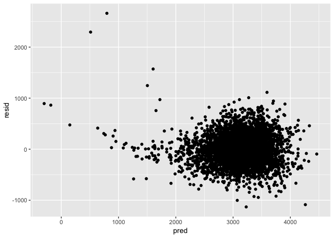

p8105\_hw3\_mm5354
================
Mengran Ma
2018/11/15

Problem 1
=========

### Create a city\_state variable (e.g. “Baltimore, MD”), and a binary variable indicating whether the homicide is solved. Omit cities Dallas, TX; Phoenix, AZ; and Kansas City, MO – these don’t report victim race. Also omit Tulsa, AL – this is a data entry mistake. Modifiy victim\_race to have categories white and non-white, with white as the reference category. Be sure that victim\_age is numeric.

``` r
tidy_data = 
  read_csv("/Users/nadongma/Desktop/p8105_hw5_mm5354/homicide_data.csv") %>% 
  janitor::clean_names() %>%
  unite(city_state, city, state, sep = ", ", remove = FALSE) %>%
  mutate(solved_or_not = 1) %>%
  mutate(solved_or_not = 0 * (disposition != "Closed by arrest") + 1 * (disposition == "Closed by arrest")) %>%
  filter(city_state != "Dallas, TX" & city_state != "Phoenix, AZ" & city_state != "Kansas City, MO" & city_state != "Tulsa, AL") %>%
  filter(victim_race != "Unknown") %>% 
  mutate(victim_race = 1 * (victim_race != "White") + 0 * (victim_race == "White")) %>% 
  #mutate(victim_race = fct_relevel(victim_race, "White")) %>% 
  mutate(victim_age = as.numeric(victim_age))
```

    ## Parsed with column specification:
    ## cols(
    ##   uid = col_character(),
    ##   reported_date = col_integer(),
    ##   victim_last = col_character(),
    ##   victim_first = col_character(),
    ##   victim_race = col_character(),
    ##   victim_age = col_character(),
    ##   victim_sex = col_character(),
    ##   city = col_character(),
    ##   state = col_character(),
    ##   lat = col_double(),
    ##   lon = col_double(),
    ##   disposition = col_character()
    ## )

    ## Warning in evalq(as.numeric(victim_age), <environment>): 强制改变过程中产生
    ## 了NA

### For the city of Baltimore, MD, use the glm function to fit a logistic regression with resolved vs unresolved as the outcome and victim age, sex and race (as just defined) as predictors. Save the output of glm as an R object; apply the broom::tidy to this object; and obtain the estimate and confidence interval of the adjusted odds ratio for solving homicides comparing non-white victims to white victims keeping all other variables fixed.

``` r
logistic_regression = tidy_data %>% 
  filter(city_state == "Baltimore, MD") %>% 
  glm(solved_or_not ~ victim_age + victim_sex + victim_race, data = ., family = binomial()) %>%
  broom::tidy() %>%
  mutate(OR = exp(estimate),
         lower_bound = exp(estimate - std.error*1.96),
         upper_bound = exp(estimate + std.error*1.96)) %>%
  select(term, log_OR = estimate, lower_bound, upper_bound, OR, p.value) %>% 
  knitr::kable(digits = 3)
logistic_regression
```

| term            |  log\_OR|  lower\_bound|  upper\_bound|     OR|  p.value|
|:----------------|--------:|-------------:|-------------:|------:|--------:|
| (Intercept)     |    1.186|         2.067|         5.186|  3.274|    0.000|
| victim\_age     |   -0.007|         0.987|         0.999|  0.993|    0.032|
| victim\_sexMale |   -0.888|         0.315|         0.537|  0.412|    0.000|
| victim\_race    |   -0.820|         0.313|         0.620|  0.441|    0.000|

### Now run glm for each of the cities in your dataset, and extract the adjusted odds ratio (and CI) for solving homicides comparing non-white victims to white victims. Do this within a “tidy” pipeline, making use of purrr::map, list columns, and unnest as necessary to create a dataframe with estimated ORs and CIs for each city.

``` r
city_nest = tidy_data %>% 
  group_by(city_state) %>% 
  nest() %>%
  mutate(models = map(data, ~glm(solved_or_not ~ victim_age + victim_race + victim_sex, data = ., family = binomial())),
         models = map(models, broom::tidy)) %>% 
  select(-data) %>% 
  unnest() %>%
  mutate(OR = exp(estimate),
         lower_bound = exp(estimate - std.error*1.96),
         upper_bound = exp(estimate + std.error*1.96)) %>%
  select(city_state, term, log_OR = estimate, OR, lower_bound, upper_bound, p.value)
city_nest %>% 
  knitr::kable(digits = 3)
```

| city\_state        | term               |  log\_OR|           OR|  lower\_bound|   upper\_bound|  p.value|
|:-------------------|:-------------------|--------:|------------:|-------------:|--------------:|--------:|
| Albuquerque, NM    | (Intercept)        |    1.226|        3.409|         1.582|   7.348000e+00|    0.002|
| Albuquerque, NM    | victim\_age        |   -0.023|        0.977|         0.963|   9.910000e-01|    0.001|
| Albuquerque, NM    | victim\_race       |   -0.302|        0.739|         0.447|   1.223000e+00|    0.240|
| Albuquerque, NM    | victim\_sexMale    |    0.488|        1.629|         0.921|   2.884000e+00|    0.094|
| Albuquerque, NM    | victim\_sexUnknown |  -14.762|        0.000|         0.000|            Inf|    0.987|
| Atlanta, GA        | (Intercept)        |    1.152|        3.165|         1.559|   6.429000e+00|    0.001|
| Atlanta, GA        | victim\_age        |   -0.012|        0.988|         0.979|   9.970000e-01|    0.010|
| Atlanta, GA        | victim\_race       |   -0.284|        0.753|         0.432|   1.313000e+00|    0.317|
| Atlanta, GA        | victim\_sexMale    |   -0.010|        0.990|         0.679|   1.443000e+00|    0.958|
| Baltimore, MD      | (Intercept)        |    1.186|        3.274|         2.067|   5.186000e+00|    0.000|
| Baltimore, MD      | victim\_age        |   -0.007|        0.993|         0.987|   9.990000e-01|    0.032|
| Baltimore, MD      | victim\_race       |   -0.820|        0.441|         0.313|   6.200000e-01|    0.000|
| Baltimore, MD      | victim\_sexMale    |   -0.888|        0.412|         0.315|   5.370000e-01|    0.000|
| Baton Rouge, LA    | (Intercept)        |    1.443|        4.231|         1.549|   1.155800e+01|    0.005|
| Baton Rouge, LA    | victim\_age        |   -0.003|        0.997|         0.982|   1.011000e+00|    0.646|
| Baton Rouge, LA    | victim\_race       |   -0.404|        0.668|         0.313|   1.425000e+00|    0.296|
| Baton Rouge, LA    | victim\_sexMale    |   -0.943|        0.389|         0.217|   6.990000e-01|    0.002|
| Birmingham, AL     | (Intercept)        |    0.670|        1.955|         0.942|   4.057000e+00|    0.072|
| Birmingham, AL     | victim\_age        |   -0.010|        0.991|         0.981|   1.000000e+00|    0.055|
| Birmingham, AL     | victim\_race       |    0.039|        1.039|         0.615|   1.756000e+00|    0.886|
| Birmingham, AL     | victim\_sexMale    |   -0.128|        0.880|         0.583|   1.329000e+00|    0.544|
| Boston, MA         | (Intercept)        |    2.556|       12.889|         4.246|   3.913000e+01|    0.000|
| Boston, MA         | victim\_age        |    0.003|        1.003|         0.989|   1.018000e+00|    0.648|
| Boston, MA         | victim\_race       |   -2.151|        0.116|         0.048|   2.820000e-01|    0.000|
| Boston, MA         | victim\_sexMale    |   -0.749|        0.473|         0.272|   8.230000e-01|    0.008|
| Boston, MA         | victim\_sexUnknown |   -1.158|        0.314|         0.049|   2.034000e+00|    0.224|
| Buffalo, NY        | (Intercept)        |    0.547|        1.729|         0.692|   4.319000e+00|    0.241|
| Buffalo, NY        | victim\_age        |    0.011|        1.011|         0.997|   1.025000e+00|    0.120|
| Buffalo, NY        | victim\_race       |   -0.936|        0.392|         0.214|   7.190000e-01|    0.002|
| Buffalo, NY        | victim\_sexMale    |   -0.592|        0.553|         0.318|   9.640000e-01|    0.037|
| Charlotte, NC      | (Intercept)        |    1.667|        5.294|         2.425|   1.155900e+01|    0.000|
| Charlotte, NC      | victim\_age        |   -0.004|        0.996|         0.984|   1.008000e+00|    0.512|
| Charlotte, NC      | victim\_race       |   -0.584|        0.558|         0.321|   9.690000e-01|    0.038|
| Charlotte, NC      | victim\_sexMale    |   -0.137|        0.872|         0.566|   1.341000e+00|    0.532|
| Chicago, IL        | (Intercept)        |    0.144|        1.154|         0.819|   1.627000e+00|    0.412|
| Chicago, IL        | victim\_age        |    0.005|        1.005|         1.001|   1.010000e+00|    0.028|
| Chicago, IL        | victim\_race       |   -0.576|        0.562|         0.431|   7.330000e-01|    0.000|
| Chicago, IL        | victim\_sexMale    |   -0.878|        0.416|         0.348|   4.970000e-01|    0.000|
| Cincinnati, OH     | (Intercept)        |    2.356|       10.553|         4.690|   2.374700e+01|    0.000|
| Cincinnati, OH     | victim\_age        |   -0.010|        0.990|         0.979|   1.002000e+00|    0.092|
| Cincinnati, OH     | victim\_race       |   -1.145|        0.318|         0.184|   5.510000e-01|    0.000|
| Cincinnati, OH     | victim\_sexMale    |   -0.931|        0.394|         0.233|   6.670000e-01|    0.001|
| Cincinnati, OH     | victim\_sexUnknown |   12.533|   277329.920|         0.000|            Inf|    0.981|
| Columbus, OH       | (Intercept)        |    0.268|        1.308|         0.809|   2.115000e+00|    0.274|
| Columbus, OH       | victim\_age        |    0.008|        1.008|         0.999|   1.017000e+00|    0.081|
| Columbus, OH       | victim\_race       |   -0.150|        0.861|         0.638|   1.161000e+00|    0.325|
| Columbus, OH       | victim\_sexMale    |   -0.626|        0.535|         0.383|   7.480000e-01|    0.000|
| Denver, CO         | (Intercept)        |    1.197|        3.309|         1.465|   7.473000e+00|    0.004|
| Denver, CO         | victim\_age        |   -0.010|        0.990|         0.976|   1.004000e+00|    0.149|
| Denver, CO         | victim\_race       |   -0.508|        0.602|         0.359|   1.009000e+00|    0.054|
| Denver, CO         | victim\_sexMale    |   -0.848|        0.428|         0.244|   7.530000e-01|    0.003|
| Detroit, MI        | (Intercept)        |    0.421|        1.524|         1.026|   2.264000e+00|    0.037|
| Detroit, MI        | victim\_age        |    0.003|        1.003|         0.997|   1.009000e+00|    0.359|
| Detroit, MI        | victim\_race       |   -0.428|        0.652|         0.488|   8.700000e-01|    0.004|
| Detroit, MI        | victim\_sexMale    |   -0.560|        0.571|         0.455|   7.180000e-01|    0.000|
| Durham, NC         | (Intercept)        |    1.121|        3.067|         1.001|   9.393000e+00|    0.050|
| Durham, NC         | victim\_age        |   -0.006|        0.994|         0.977|   1.011000e+00|    0.491|
| Durham, NC         | victim\_race       |    0.003|        1.003|         0.404|   2.489000e+00|    0.995|
| Durham, NC         | victim\_sexMale    |   -0.466|        0.628|         0.311|   1.265000e+00|    0.193|
| Fort Worth, TX     | (Intercept)        |    1.039|        2.828|         1.484|   5.389000e+00|    0.002|
| Fort Worth, TX     | victim\_age        |   -0.019|        0.981|         0.971|   9.920000e-01|    0.001|
| Fort Worth, TX     | victim\_race       |   -0.177|        0.838|         0.555|   1.266000e+00|    0.401|
| Fort Worth, TX     | victim\_sexMale    |   -0.177|        0.837|         0.547|   1.281000e+00|    0.414|
| Fresno, CA         | (Intercept)        |    1.961|        7.104|         2.701|   1.868100e+01|    0.000|
| Fresno, CA         | victim\_age        |   -0.002|        0.998|         0.985|   1.010000e+00|    0.702|
| Fresno, CA         | victim\_race       |   -0.810|        0.445|         0.229|   8.640000e-01|    0.017|
| Fresno, CA         | victim\_sexMale    |   -0.619|        0.538|         0.300|   9.650000e-01|    0.038|
| Houston, TX        | (Intercept)        |    0.565|        1.760|         1.276|   2.427000e+00|    0.001|
| Houston, TX        | victim\_age        |   -0.006|        0.994|         0.989|   9.990000e-01|    0.011|
| Houston, TX        | victim\_race       |   -0.136|        0.873|         0.699|   1.090000e+00|    0.230|
| Houston, TX        | victim\_sexMale    |   -0.324|        0.723|         0.597|   8.770000e-01|    0.001|
| Indianapolis, IN   | (Intercept)        |    1.070|        2.915|         1.886|   4.507000e+00|    0.000|
| Indianapolis, IN   | victim\_age        |   -0.007|        0.993|         0.985|   1.001000e+00|    0.070|
| Indianapolis, IN   | victim\_race       |   -0.684|        0.505|         0.382|   6.670000e-01|    0.000|
| Indianapolis, IN   | victim\_sexMale    |   -0.132|        0.876|         0.655|   1.173000e+00|    0.375|
| Jacksonville, FL   | (Intercept)        |    0.738|        2.092|         1.372|   3.188000e+00|    0.001|
| Jacksonville, FL   | victim\_age        |   -0.007|        0.993|         0.986|   1.001000e+00|    0.085|
| Jacksonville, FL   | victim\_race       |   -0.418|        0.658|         0.502|   8.620000e-01|    0.002|
| Jacksonville, FL   | victim\_sexMale    |   -0.336|        0.715|         0.535|   9.540000e-01|    0.023|
| Las Vegas, NV      | (Intercept)        |    0.842|        2.321|         1.556|   3.462000e+00|    0.000|
| Las Vegas, NV      | victim\_age        |   -0.005|        0.995|         0.989|   1.002000e+00|    0.177|
| Las Vegas, NV      | victim\_race       |   -0.271|        0.763|         0.592|   9.820000e-01|    0.036|
| Las Vegas, NV      | victim\_sexMale    |   -0.061|        0.940|         0.725|   1.219000e+00|    0.643|
| Las Vegas, NV      | victim\_sexUnknown |   12.191|   197033.765|         0.000|  5.272027e+281|    0.970|
| Long Beach, CA     | (Intercept)        |    0.886|        2.426|         0.839|   7.013000e+00|    0.102|
| Long Beach, CA     | victim\_age        |    0.008|        1.008|         0.993|   1.024000e+00|    0.274|
| Long Beach, CA     | victim\_race       |   -0.231|        0.794|         0.388|   1.626000e+00|    0.528|
| Long Beach, CA     | victim\_sexMale    |   -0.672|        0.510|         0.269|   9.700000e-01|    0.040|
| Los Angeles, CA    | (Intercept)        |    0.597|        1.817|         1.154|   2.862000e+00|    0.010|
| Los Angeles, CA    | victim\_age        |    0.004|        1.004|         0.998|   1.010000e+00|    0.187|
| Los Angeles, CA    | victim\_race       |   -0.407|        0.666|         0.483|   9.180000e-01|    0.013|
| Los Angeles, CA    | victim\_sexMale    |   -0.396|        0.673|         0.519|   8.730000e-01|    0.003|
| Louisville, KY     | (Intercept)        |    1.811|        6.118|         3.120|   1.199600e+01|    0.000|
| Louisville, KY     | victim\_age        |   -0.011|        0.990|         0.978|   1.001000e+00|    0.078|
| Louisville, KY     | victim\_race       |   -0.937|        0.392|         0.259|   5.930000e-01|    0.000|
| Louisville, KY     | victim\_sexMale    |   -0.734|        0.480|         0.299|   7.710000e-01|    0.002|
| Louisville, KY     | victim\_sexUnknown |   12.692|   325014.423|         0.000|            Inf|    0.981|
| Memphis, TN        | (Intercept)        |    1.774|        5.892|         3.386|   1.025300e+01|    0.000|
| Memphis, TN        | victim\_age        |   -0.016|        0.984|         0.977|   9.920000e-01|    0.000|
| Memphis, TN        | victim\_race       |   -0.251|        0.778|         0.521|   1.162000e+00|    0.221|
| Memphis, TN        | victim\_sexMale    |   -0.330|        0.719|         0.531|   9.740000e-01|    0.033|
| Miami, FL          | (Intercept)        |    0.395|        1.485|         0.705|   3.127000e+00|    0.298|
| Miami, FL          | victim\_age        |   -0.003|        0.997|         0.985|   1.010000e+00|    0.669|
| Miami, FL          | victim\_race       |   -0.550|        0.577|         0.376|   8.850000e-01|    0.012|
| Miami, FL          | victim\_sexMale    |   -0.640|        0.527|         0.315|   8.810000e-01|    0.015|
| Miami, FL          | victim\_sexUnknown |  -13.304|        0.000|         0.000|            Inf|    0.980|
| Milwaukee, wI      | (Intercept)        |    1.596|        4.934|         2.684|   9.073000e+00|    0.000|
| Milwaukee, wI      | victim\_age        |   -0.012|        0.988|         0.980|   9.970000e-01|    0.009|
| Milwaukee, wI      | victim\_race       |   -0.458|        0.632|         0.403|   9.910000e-01|    0.046|
| Milwaukee, wI      | victim\_sexMale    |   -0.292|        0.747|         0.526|   1.061000e+00|    0.103|
| Minneapolis, MN    | (Intercept)        |    0.195|        1.215|         0.484|   3.050000e+00|    0.678|
| Minneapolis, MN    | victim\_age        |    0.010|        1.010|         0.995|   1.025000e+00|    0.213|
| Minneapolis, MN    | victim\_race       |   -0.437|        0.646|         0.345|   1.209000e+00|    0.172|
| Minneapolis, MN    | victim\_sexMale    |   -0.154|        0.858|         0.460|   1.597000e+00|    0.628|
| Minneapolis, MN    | victim\_sexUnknown |  -13.561|        0.000|         0.000|            Inf|    0.980|
| Nashville, TN      | (Intercept)        |    0.705|        2.023|         1.187|   3.447000e+00|    0.010|
| Nashville, TN      | victim\_age        |   -0.003|        0.997|         0.987|   1.007000e+00|    0.581|
| Nashville, TN      | victim\_race       |   -0.103|        0.902|         0.656|   1.241000e+00|    0.527|
| Nashville, TN      | victim\_sexMale    |    0.017|        1.017|         0.678|   1.526000e+00|    0.935|
| New Orleans, LA    | (Intercept)        |    1.124|        3.077|         1.652|   5.731000e+00|    0.000|
| New Orleans, LA    | victim\_age        |   -0.020|        0.981|         0.972|   9.900000e-01|    0.000|
| New Orleans, LA    | victim\_race       |   -0.762|        0.467|         0.295|   7.380000e-01|    0.001|
| New Orleans, LA    | victim\_sexMale    |   -0.486|        0.615|         0.446|   8.480000e-01|    0.003|
| New York, NY       | (Intercept)        |    1.639|        5.152|         2.152|   1.233400e+01|    0.000|
| New York, NY       | victim\_age        |    0.009|        1.009|         0.998|   1.020000e+00|    0.116|
| New York, NY       | victim\_race       |   -0.632|        0.532|         0.279|   1.012000e+00|    0.054|
| New York, NY       | victim\_sexMale    |   -1.074|        0.342|         0.211|   5.540000e-01|    0.000|
| Oakland, CA        | (Intercept)        |    1.826|        6.207|         2.648|   1.454700e+01|    0.000|
| Oakland, CA        | victim\_age        |    0.004|        1.004|         0.994|   1.014000e+00|    0.403|
| Oakland, CA        | victim\_race       |   -1.547|        0.213|         0.104|   4.350000e-01|    0.000|
| Oakland, CA        | victim\_sexMale    |   -0.736|        0.479|         0.325|   7.060000e-01|    0.000|
| Oakland, CA        | victim\_sexUnknown |   12.120|   183454.766|         0.000|  4.908988e+281|    0.970|
| Oklahoma City, OK  | (Intercept)        |    0.642|        1.900|         1.113|   3.243000e+00|    0.019|
| Oklahoma City, OK  | victim\_age        |   -0.006|        0.995|         0.984|   1.005000e+00|    0.297|
| Oklahoma City, OK  | victim\_race       |   -0.384|        0.681|         0.478|   9.710000e-01|    0.034|
| Oklahoma City, OK  | victim\_sexMale    |   -0.194|        0.824|         0.557|   1.219000e+00|    0.332|
| Omaha, NE          | (Intercept)        |    2.424|       11.292|         4.516|   2.823500e+01|    0.000|
| Omaha, NE          | victim\_age        |    0.002|        1.002|         0.986|   1.018000e+00|    0.776|
| Omaha, NE          | victim\_race       |   -1.771|        0.170|         0.094|   3.070000e-01|    0.000|
| Omaha, NE          | victim\_sexMale    |   -0.965|        0.381|         0.207|   7.010000e-01|    0.002|
| Philadelphia, PA   | (Intercept)        |    1.310|        3.707|         2.464|   5.575000e+00|    0.000|
| Philadelphia, PA   | victim\_age        |    0.000|        1.000|         0.994|   1.005000e+00|    0.885|
| Philadelphia, PA   | victim\_race       |   -0.440|        0.644|         0.486|   8.520000e-01|    0.002|
| Philadelphia, PA   | victim\_sexMale    |   -0.764|        0.466|         0.363|   5.980000e-01|    0.000|
| Pittsburgh, PA     | (Intercept)        |    1.523|        4.588|         2.094|   1.005200e+01|    0.000|
| Pittsburgh, PA     | victim\_age        |    0.005|        1.005|         0.992|   1.017000e+00|    0.452|
| Pittsburgh, PA     | victim\_race       |   -1.267|        0.282|         0.161|   4.930000e-01|    0.000|
| Pittsburgh, PA     | victim\_sexMale    |   -0.794|        0.452|         0.280|   7.310000e-01|    0.001|
| Pittsburgh, PA     | victim\_sexUnknown |   13.310|   603211.593|         0.000|            Inf|    0.980|
| Richmond, VA       | (Intercept)        |    2.321|       10.181|         2.566|   4.039900e+01|    0.001|
| Richmond, VA       | victim\_age        |   -0.020|        0.980|         0.961|   9.990000e-01|    0.040|
| Richmond, VA       | victim\_race       |   -0.804|        0.447|         0.162|   1.238000e+00|    0.121|
| Richmond, VA       | victim\_sexMale    |   -0.070|        0.932|         0.462|   1.881000e+00|    0.845|
| San Antonio, TX    | (Intercept)        |    1.123|        3.075|         1.699|   5.566000e+00|    0.000|
| San Antonio, TX    | victim\_age        |   -0.013|        0.987|         0.978|   9.960000e-01|    0.006|
| San Antonio, TX    | victim\_race       |   -0.372|        0.689|         0.461|   1.030000e+00|    0.069|
| San Antonio, TX    | victim\_sexMale    |   -0.105|        0.900|         0.635|   1.277000e+00|    0.556|
| Sacramento, CA     | (Intercept)        |    1.033|        2.808|         1.174|   6.715000e+00|    0.020|
| Sacramento, CA     | victim\_age        |    0.004|        1.004|         0.991|   1.018000e+00|    0.528|
| Sacramento, CA     | victim\_race       |   -0.248|        0.781|         0.449|   1.359000e+00|    0.381|
| Sacramento, CA     | victim\_sexMale    |   -0.512|        0.599|         0.332|   1.081000e+00|    0.089|
| Sacramento, CA     | victim\_sexUnknown |  -14.450|        0.000|         0.000|            Inf|    0.978|
| Savannah, GA       | (Intercept)        |    0.583|        1.792|         0.605|   5.303000e+00|    0.292|
| Savannah, GA       | victim\_age        |    0.001|        1.001|         0.983|   1.019000e+00|    0.935|
| Savannah, GA       | victim\_race       |   -0.503|        0.605|         0.284|   1.288000e+00|    0.193|
| Savannah, GA       | victim\_sexMale    |   -0.107|        0.898|         0.438|   1.842000e+00|    0.770|
| San Bernardino, CA | (Intercept)        |   -0.404|        0.668|         0.180|   2.476000e+00|    0.546|
| San Bernardino, CA | victim\_age        |    0.012|        1.012|         0.993|   1.032000e+00|    0.212|
| San Bernardino, CA | victim\_race       |   -0.128|        0.880|         0.393|   1.972000e+00|    0.756|
| San Bernardino, CA | victim\_sexMale    |   -0.447|        0.640|         0.311|   1.314000e+00|    0.224|
| San Bernardino, CA | victim\_sexUnknown |   14.256|  1554176.716|         0.000|            Inf|    0.987|
| San Diego, CA      | (Intercept)        |    1.484|        4.411|         1.972|   9.865000e+00|    0.000|
| San Diego, CA      | victim\_age        |   -0.004|        0.996|         0.984|   1.008000e+00|    0.478|
| San Diego, CA      | victim\_race       |   -0.727|        0.483|         0.298|   7.850000e-01|    0.003|
| San Diego, CA      | victim\_sexMale    |   -0.372|        0.689|         0.425|   1.118000e+00|    0.132|
| San Francisco, CA  | (Intercept)        |    0.356|        1.427|         0.633|   3.221000e+00|    0.391|
| San Francisco, CA  | victim\_age        |    0.024|        1.024|         1.012|   1.036000e+00|    0.000|
| San Francisco, CA  | victim\_race       |   -0.780|        0.458|         0.290|   7.230000e-01|    0.001|
| San Francisco, CA  | victim\_sexMale    |   -0.616|        0.540|         0.314|   9.300000e-01|    0.026|
| St. Louis, MO      | (Intercept)        |    0.787|        2.196|         1.324|   3.643000e+00|    0.002|
| St. Louis, MO      | victim\_age        |   -0.005|        0.995|         0.987|   1.003000e+00|    0.197|
| St. Louis, MO      | victim\_race       |   -0.550|        0.577|         0.406|   8.200000e-01|    0.002|
| St. Louis, MO      | victim\_sexMale    |   -0.338|        0.713|         0.539|   9.440000e-01|    0.018|
| Stockton, CA       | (Intercept)        |    0.465|        1.592|         0.654|   3.871000e+00|    0.305|
| Stockton, CA       | victim\_age        |   -0.001|        0.999|         0.986|   1.012000e+00|    0.862|
| Stockton, CA       | victim\_race       |   -0.979|        0.376|         0.196|   7.190000e-01|    0.003|
| Stockton, CA       | victim\_sexMale    |    0.034|        1.034|         0.589|   1.817000e+00|    0.907|
| Tampa, FL          | (Intercept)        |    0.516|        1.675|         0.541|   5.183000e+00|    0.371|
| Tampa, FL          | victim\_age        |   -0.003|        0.997|         0.979|   1.016000e+00|    0.769|
| Tampa, FL          | victim\_race       |    0.147|        1.159|         0.587|   2.288000e+00|    0.671|
| Tampa, FL          | victim\_sexMale    |   -0.420|        0.657|         0.300|   1.442000e+00|    0.295|
| Tulsa, OK          | (Intercept)        |    1.199|        3.316|         1.880|   5.850000e+00|    0.000|
| Tulsa, OK          | victim\_age        |   -0.005|        0.995|         0.983|   1.006000e+00|    0.363|
| Tulsa, OK          | victim\_race       |   -0.518|        0.596|         0.408|   8.690000e-01|    0.007|
| Tulsa, OK          | victim\_sexMale    |   -0.003|        0.997|         0.649|   1.533000e+00|    0.989|
| Tulsa, OK          | victim\_sexUnknown |   13.082|   480178.415|         0.000|            Inf|    0.981|
| Washington, DC     | (Intercept)        |    1.498|        4.471|         1.938|   1.031500e+01|    0.000|
| Washington, DC     | victim\_age        |   -0.008|        0.992|         0.984|   1.000000e+00|    0.048|
| Washington, DC     | victim\_race       |   -0.673|        0.510|         0.258|   1.010000e+00|    0.053|
| Washington, DC     | victim\_sexMale    |   -0.380|        0.684|         0.471|   9.920000e-01|    0.045|
| Washington, DC     | victim\_sexUnknown |   -0.006|        0.994|         0.461|   2.144000e+00|    0.988|

``` r
city_nest %>% 
  filter(term == "victim_race") %>% 
  mutate(city_state = fct_reorder(city_state, OR)) %>% 
  ggplot(aes(x = city_state, y = OR, color = city_state)) +
  geom_point() +
  geom_errorbar(aes(ymin = lower_bound , ymax = upper_bound), width = 0.25) +
  labs(
      title = "Proportion estimates and CIs for each city",
      x = "City",
      y = "Estimate"
      ) +
  theme(axis.text.x = element_text(angle = 90, size = 6)) +
  theme(legend.position = "none")
```


``` r
tidy_data_P2 = 
  read_csv("/Users/nadongma/Desktop/p8105_hw6_mm5354/birthweight.csv") %>% 
  janitor::clean_names() %>%
  mutate(babysex = as.factor(babysex),
         frace = as.factor(frace),
         malform = as.factor(malform),
         mrace = as.factor(mrace)) %>% 
  mutate(babysex_recode = 1) %>%
  mutate(babysex_recode = 0 * (babysex != 1) + 1 * (babysex == 1)) 
```

    ## Parsed with column specification:
    ## cols(
    ##   .default = col_integer(),
    ##   gaweeks = col_double(),
    ##   ppbmi = col_double(),
    ##   smoken = col_double()
    ## )

    ## See spec(...) for full column specifications.

``` r
fit = lm(bwt ~ bhead + blength + wtgain, data = tidy_data_P2)
tidy_data_P2 = modelr::add_residuals(tidy_data_P2, fit)
tidy_data_P2 = modelr::add_predictions(tidy_data_P2, fit)
tidy_data_P2
```

    ## # A tibble: 4,342 x 23
    ##    babysex bhead blength   bwt delwt fincome frace gaweeks malform menarche
    ##    <fct>   <int>   <int> <int> <int>   <int> <fct>   <dbl> <fct>      <int>
    ##  1 2          34      51  3629   177      35 1        39.9 0             13
    ##  2 1          34      48  3062   156      65 2        25.9 0             14
    ##  3 2          36      50  3345   148      85 1        39.9 0             12
    ##  4 1          34      52  3062   157      55 1        40   0             14
    ##  5 2          34      52  3374   156       5 1        41.6 0             13
    ##  6 1          33      52  3374   129      55 1        40.7 0             12
    ##  7 2          33      46  2523   126      96 2        40.3 0             14
    ##  8 2          33      49  2778   140       5 1        37.4 0             12
    ##  9 1          36      52  3515   146      85 1        40.3 0             11
    ## 10 1          33      50  3459   169      75 2        40.7 0             12
    ## # ... with 4,332 more rows, and 13 more variables: mheight <int>,
    ## #   momage <int>, mrace <fct>, parity <int>, pnumlbw <int>, pnumsga <int>,
    ## #   ppbmi <dbl>, ppwt <int>, smoken <dbl>, wtgain <int>,
    ## #   babysex_recode <dbl>, resid <dbl>, pred <dbl>

``` r
tidy_data_P2 %>% 
  ggplot(aes(x = pred, y = resid))+geom_point()
```



``` r
fit2 = lm(bwt ~ blength + gaweeks, data = tidy_data_P2)
fit2
```

    ## 
    ## Call:
    ## lm(formula = bwt ~ blength + gaweeks, data = tidy_data_P2)
    ## 
    ## Coefficients:
    ## (Intercept)      blength      gaweeks  
    ##    -4347.67       128.56        27.05

``` r
fit3 = lm(bwt ~ bhead + blength + babysex + bhead*babysex + bhead*blength + blength*babysex, data = tidy_data_P2)
fit3
```

    ## 
    ## Call:
    ## lm(formula = bwt ~ bhead + blength + babysex + bhead * babysex + 
    ##     bhead * blength + blength * babysex, data = tidy_data_P2)
    ## 
    ## Coefficients:
    ##      (Intercept)             bhead           blength          babysex2  
    ##        -3768.305            79.506            31.511           259.978  
    ##   bhead:babysex2     bhead:blength  blength:babysex2  
    ##          -12.662             1.561             4.211

``` r
cv_P2 = tidy_data_P2 %>%
  crossv_mc(n = 50)

print(cv_P2)
```

    ## # A tibble: 50 x 3
    ##    train          test           .id  
    ##    <list>         <list>         <chr>
    ##  1 <S3: resample> <S3: resample> 01   
    ##  2 <S3: resample> <S3: resample> 02   
    ##  3 <S3: resample> <S3: resample> 03   
    ##  4 <S3: resample> <S3: resample> 04   
    ##  5 <S3: resample> <S3: resample> 05   
    ##  6 <S3: resample> <S3: resample> 06   
    ##  7 <S3: resample> <S3: resample> 07   
    ##  8 <S3: resample> <S3: resample> 08   
    ##  9 <S3: resample> <S3: resample> 09   
    ## 10 <S3: resample> <S3: resample> 10   
    ## # ... with 40 more rows

``` r
cv_models = cv_P2 %>%
  mutate(model = map(train, ~lm(bwt ~ bhead + blength + wtgain, data = .)),
         model2 = map(train, ~lm(bwt ~ blength + gaweeks, data = .)),
         model3 = map(train, ~lm(bwt ~ bhead + blength + babysex + bhead*babysex + bhead*blength + blength*babysex, data = .)))

print(cv_models)
```

    ## # A tibble: 50 x 6
    ##    train          test           .id   model    model2   model3  
    ##    <list>         <list>         <chr> <list>   <list>   <list>  
    ##  1 <S3: resample> <S3: resample> 01    <S3: lm> <S3: lm> <S3: lm>
    ##  2 <S3: resample> <S3: resample> 02    <S3: lm> <S3: lm> <S3: lm>
    ##  3 <S3: resample> <S3: resample> 03    <S3: lm> <S3: lm> <S3: lm>
    ##  4 <S3: resample> <S3: resample> 04    <S3: lm> <S3: lm> <S3: lm>
    ##  5 <S3: resample> <S3: resample> 05    <S3: lm> <S3: lm> <S3: lm>
    ##  6 <S3: resample> <S3: resample> 06    <S3: lm> <S3: lm> <S3: lm>
    ##  7 <S3: resample> <S3: resample> 07    <S3: lm> <S3: lm> <S3: lm>
    ##  8 <S3: resample> <S3: resample> 08    <S3: lm> <S3: lm> <S3: lm>
    ##  9 <S3: resample> <S3: resample> 09    <S3: lm> <S3: lm> <S3: lm>
    ## 10 <S3: resample> <S3: resample> 10    <S3: lm> <S3: lm> <S3: lm>
    ## # ... with 40 more rows

``` r
rmse_cv = cv_models %>%
  mutate(rmse_models_1 = map2_dbl(model, test, ~rmse(.x, .y)),
         rmse_models_2 = map2_dbl(model2, test, ~rmse(.x, .y)),
         rmse_models_3 = map2_dbl(model3, test, ~rmse(.x, .y)))
```
